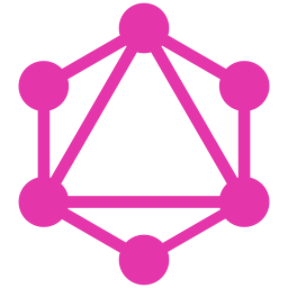

Hi fellow techies! My name is Rohit Sidhwani and I am a passionate self taught full-stack web developer from India. My passion for software lies with dreaming up ideas and making them come true with elegant interfaces. I take great care in the experience, architecture, and code quality of the things I build.  

I learned a lot from the open-source community and I love how collaboration and knowledge sharing happened through open-source.  
  
languages and tools I use:  

